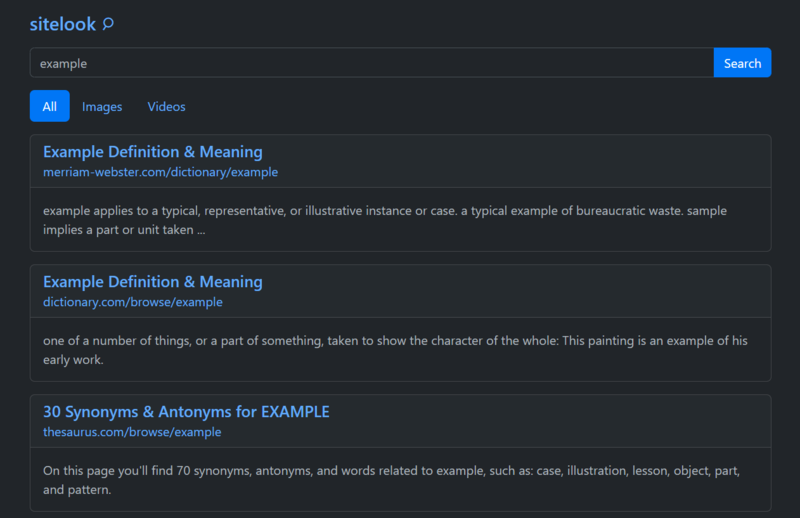
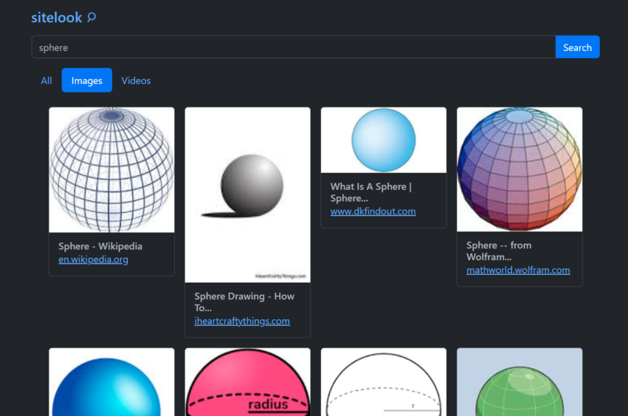

# sitelook

**Simple frontend for Google search engine written in Go.**

It is meant to be fast and secure (leaks no tracking data to Google). It is also completely server-side rendered and works without JavaScript.

## How Does It Work?

Application parses Google search page and renders a new page with the results. It can be deployed locally or to a remote server for better privacy.

## Stack

-   Go
-   Gin as a backend framework
-   Goquery for parsing html
-   Bootstrap for styling
-   Docker (WIP)

## Features

### Search Filters

So far `All` and `Images` search filters are supported. Implementation of `Videos` filter is underway. Other filters may or may not be implemented.

### Upcoming Features

You can find all upcoming and considered features in the project's [todo.md](dev/todo.md) file.

## Issues

### Captcha Issue

Google sometimes requires captcha to make a search request. Solving captchas on the frontend is not implemented and probably won't be implemented since I'm not sure if it is even possible. Instead you will be offered to proceed with the Google Search.

## Licence

MIT
